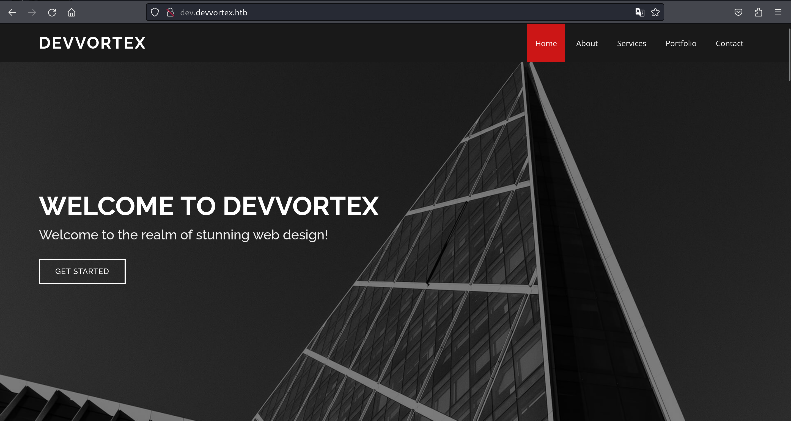
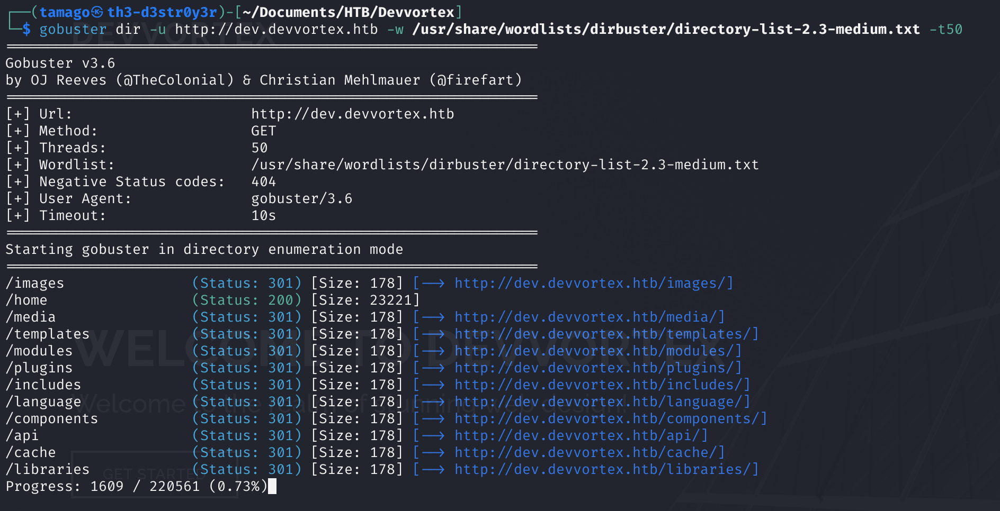
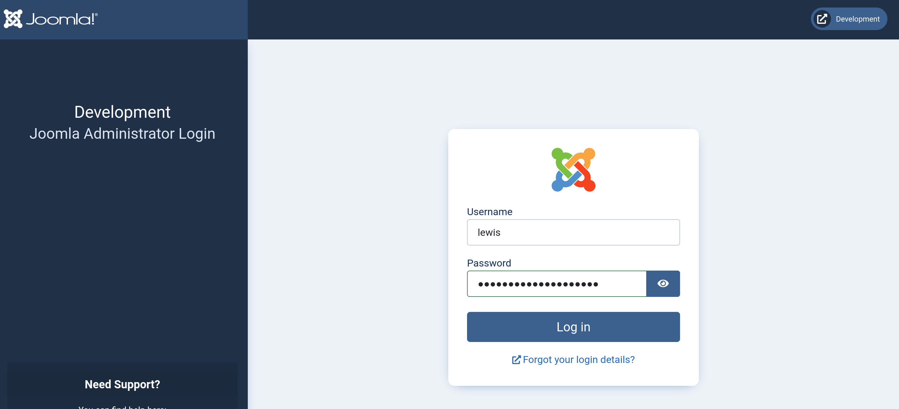

+++
author = "TamaGorengs"
title = "DevVortex HTB Writeup"
date = "2024-05-09"
description = "Devvortex writeup"
tags = [
    "writeup"
]
categories = [
    "Red Pill"
]
toc = true
image = "images/devvortex.png"
+++

## Author
* Aizzat Azman
* Syafie

## Summary :

We found 2 open ports(22, 80). We fuzz and found other subdomain which lead to directory of Joomla CMS Login Page that is vulnerable and allow us to extract DB user and password that is also used to login to the CMS. The CMS has template that allow us to inject PHP code, where we get reverse shell. We login to mysql using found credential from Joomla vulnerability and crack other user to escalate our privilege. To escalate to root, we can run apport-cli as sudo where there is vulnerability on the version where you can execute command as root when viewing the report crash since it use LESS.

## Port Scanning

First thing first, we run the machine to receive our target IP

I first run rustscan to quickly scan for open port and as we can see we have 2 open ports which is port 22(SSH) and port 80(http)

I then run nmap to scan the version and run default script. We can see that it redirect to devvortex.htb.

As we can see we can't access the machine since we the DNS can't resolve it.

Let's put the IP into /etc/hosts first.

### Web Enumeration

And now we can access it normally. Let's dig in. But before that I ran enumerate directory using automate tools.

My tools of choice is dirsearch as well as gobuster. I ran both because sometimes dirsearch miss something, vice versa.

While waiting for the tools to finish running, we explore the website. We found a contact page where we can input text. I tried inputting random strings but it just refreshed the page. Try inputting other payload like sqlinjection and XSS but none works. Move on.

We found email convention that maybe we could use for any further brute forcing.

### Subdomain Enumeration

After looking around and the result from dirsearch and gobuster doesn't seem useful. I then try fuzzing for subdomains and we found a subdomain <b>dev.devvortex.htb</b>. Nice.

We try visiting the website but like before, we have to put into /etc/hosts first.

## New Subdomain

After putting into /etc/host. We now found a new webpage to explore. And also like before, we run our directory enumeration tools before further exploring the page.

We run gobuster and dirsearch again.

We found another email but with same email naming convention. Other than that, nothing interesting that could help further. Let's check our dirsearch.

And we found directory /administrator which is super interesting. Let's have a look.

### Joomla Directory

It's a Joomla Admin login page. Joomla is a Content Management System, just like WordPress.
We try default credential, but it doesn't work.

Let's google for any exploit or vulnerability in Joomla.

Here it's show how we can get the version of the joomla. We can just copy the path, or run the script.

Here we found the version of the Joomla which is 4.2.6

Let's check for any possible exploit regarding this version of Joomla.

### CVE-2023-23752

Let's try the POC by Acceis on CVE-2023-23752.

The exploit occur because of improper access check within the application, enabling unauthorized access to critical webservice endpoints.

Here we can find the user and password.

Here we found the id, group, name and email of the users

We can just run the script and it gave us the same information.

Let's try login into the CMS using the found credential.

## Joomla CMS Dashboard

And we are in !

Just like in wordpress, normally we could run a php code somewhere in the template where we could probably get a reverse shell. After googling for reverse shell in Joomla, I came across this blog. https://www.hackingarticles.in/joomla-reverse-shell/. Basically we could inject code in the template.

We go to Systems \> Site Templates \> And click the link of the template.

### Payload Injection

In the code section, all we need to do is get a PHP reverse shell, and insert into the code. Make sure to change the IP and the Port. I chose error.php file.

Run our netcat listener on the port, and visit the file.

## Initial Foothold

And voila, we now have A reverse shell. But it's not interactive. Let's use python tty.

Much better. We are user www-data. There's /logan directory in /home. We can get into it, but we cannot user flag because we don't have permission.

## Privilege Escalation - Logan

Checking /etc/passwd. We know we have user logan. I also notice we have mysql in it. From the exploit on Joomla, we know that it extract the databases user and password. So we try login into mysql using those credential.

And looks like we can, now we have access to mysql databases. Let's see what's in here.

We found Joomla Database.

Many tables in the databases but none interesting. Yet.

And at the bottom, we found table users which is obviously interesting. Let's see what's inside.

### Password Hashes

And looks like we found user and password hash for lewis and logan.

I only crack user logan since we know from /etc/passwd, that there's no user lewis in this machine.

### Hash cracked

Hashcat manage to crack it and found the password.

SU into the user, and we are now logged in as user logan.

## Privilege Escalation - Root

As always, check low hanging fruit. We ran sudo -l to check for any sudo permission

### Apport-CLI

We found the version of the apport-cli

Googling for exploit for this version lead me to this 2 post.

https://bugs.launchpad.net/ubuntu/+source/apport/+bug/2016023
https://github.com/diego-tella/CVE-2023-1326-PoC

> If a system is specially configured to allow unprivileged users to run sudo apport-cli, less is configured as the pager, and the terminal size can be set: a local attacker can escalate privilege.

After playing with the apport-cli, -f is where we can report for any bug or problem. We can try choose any until it lead to the next option.

From here, type `V` which bring us to the new pager.

This pager uses LESS, and just like VIM, we put `!` to execute command. We run `!id` which show that we can execute as root !

### Pwned

Now we try execute `!/bin/bash` to get bash shell as root.

And lo and behold, we are now root. All we need to do now is grab the root flag and we have completed Devvortex.
